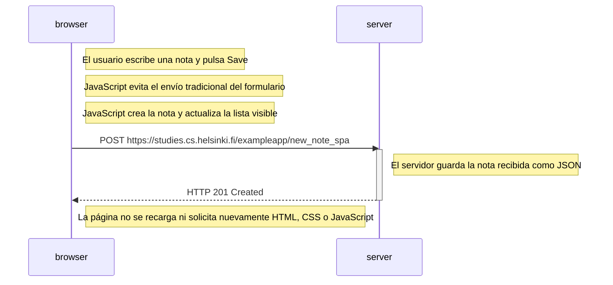

# Ejercicio 0.6: Nueva nota en la aplicación SPA

```mermaid
sequenceDiagram
    participant browser
    participant server

    Note right of browser: El usuario escribe una nota y pulsa Save
    Note right of browser: JavaScript evita el envío tradicional del formulario
    Note right of browser: JavaScript crea la nota y actualiza la lista visible

    browser->>server: POST https://studies.cs.helsinki.fi/exampleapp/new_note_spa
    activate server
    Note right of server: El servidor guarda la nota recibida como JSON
    server-->>browser: HTTP 201 Created
    deactivate server

    Note right of browser: La página no se recarga ni solicita nuevamente HTML, CSS o JavaScript
```